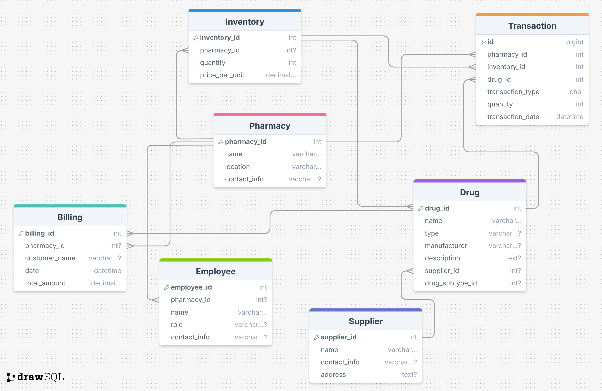

# 📦 Pharmacy Inventory Management System

## 📝 Overview
The **Pharmacy Management System** is a web-based application designed to help pharmacies efficiently manage their inventory, track drug stocks, and facilitate smooth transactions. The system ensures seamless monitoring of drugs, pharmacies, billing, and inventory while maintaining role-based authorization for security.

## 🏗️ Project Structure 
The system follows a **simplified and optimized database schema** with three main entities:

1. **Pharmacy** - A pharmacy can contain multiple inventories.
2. **Inventory** - Each inventory belongs to a pharmacy and contains multiple drugs.
3. **Drug** - Drugs are stored in an inventory and include details like quantity, price, and barcode.

## 🏛️ Database Schema


## 🔒 Authentication & Authorization
- Users must authenticate via **JWT (JSON Web Token)**.
- Role-based access control (RBAC) ensures that only **admins** can manage inventory.
- Roles available: **Admin**, **Doctor**.

## 🚀 API Endpoints
### **User Authentication**
- `POST /auth/register` → Register a new user & create an employee.
- `POST /auth/login` → Authenticate and get JWT token.

### **Pharmacy Management**
- `POST /pharmacies/` → Create a new pharmacy.
- `GET /pharmacies/` → Get a list of pharmacies.
- `GET /pharmacies/{id}` → Retrieve details of a specific pharmacy.

### **Inventory Management**
- `POST /inventories/` → Create an inventory.
- `GET /inventories/` → List all inventories.
- `GET /inventories/{id}` → Get details of an inventory.

### **Drug Management**
- `POST /drugs/` → Add a new drug to inventory.
- `GET /drugs/` → Retrieve all drugs.
- `GET /drugs/{id}` → Get drug details.

## 🛠️ Tech Stack
- **Backend**: FastAPI (Python)
- **Frontend**: Next.JS
- **Database**: SQLModel (SQLite/PostgreSQL)
- **Authentication**: JWT (Bearer Token)
- **Containerization**: Docker 

## 🔧 Setup & Installation
1. **Clone the repository:**
  ```sh
  git clone https://github.com/mo7amedgom3a/Pharmacy-Management-System
  cd Pharmacy-Management-System
  ```

2. **Backend Setup:**
  ```sh
  cd Backend
  python -m venv venv
  source venv/bin/activate  # On Windows: venv\Scripts\activate
  cd app/
  fastapi dev main.py
  ```

3. **Frontend Setup:**
  ```sh
  cd Frontend
  cd my-app/
  npm i -f
  npm run dev
  ```

4. **Access Swagger UI:**
  - Visit: `http://127.0.0.1:8000/docs`

## 📜 License
This project is licensed under the MIT License.

---
💡 *Feel free to contribute and improve the system!* 🚀